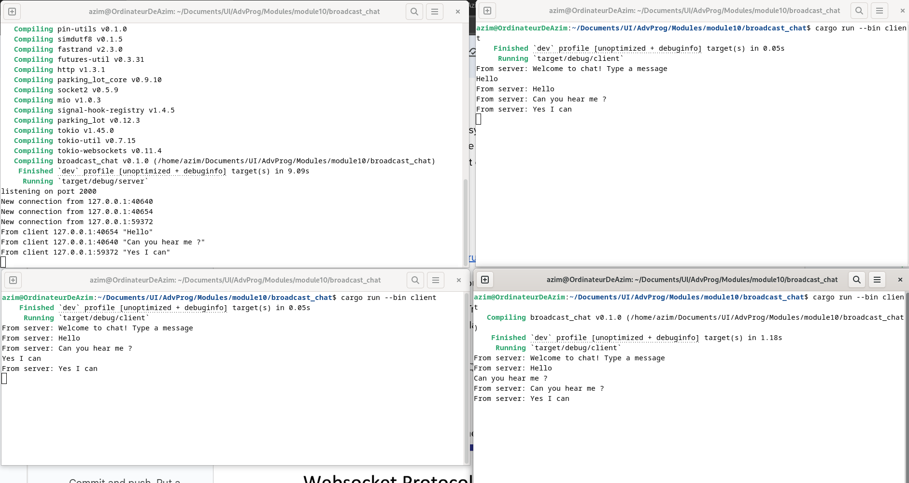
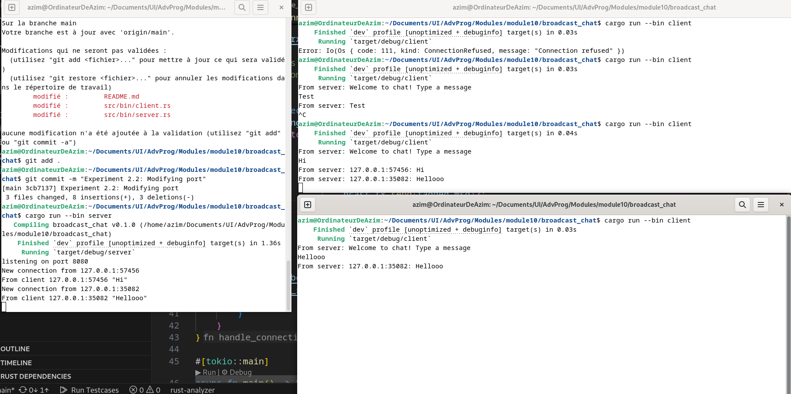

# Reflection

## 2.1 Original code of broadcast chat.

### Observations
Here is one server(top-left) and 3 other clients launched:

### Explanations

- Server (Top-Left) : It listens on port 2000. As shown in the output, three clients have successfully connected from 127.0.0.1 (localhost) but with different port numbers. Then, all messages received from clients are printed in the terminal, with their source client.

- Clients : Then, I sent 'Hello', 'Can you hear me', 'Yes I can" with the clients 1,2 and 3 respectively. Each time a message was sent with a client, the server notified all clients that he received a message, with its content.

## 2.2 Modifying the websocket port

To change the WebSocket connection port, I replaced "127.0.0.1:2000" with "127.0.0.1:8080" in both the server.rs file (in the TcpListener::bind call) and the client.rs file (in the ClientBuilder::from_uri call). This change is necessary because a connection involves two sides — the server and the client — which must be on the same port to communicate. After recompiling and rerunning the application, the chat system continued to function correctly, confirming that the port change was successful. Both files use the same WebSocket protocol, implemented via the tokio_websockets crate, with the server using ServerBuilder::new().accept(...) and the client using ClientBuilder::from_uri(...).connect() to establish the connection.

## 2.3 Small changes. Add some information to client

### Observations
Here is one server(left) and 2 other clients launched:

### Explanations

I modified the server so that each message sent includes the sender’s IP address and port. Instead of only sending the raw message text, I updated the server logic to prepend the sender’s socket address (e.g., "127.0.0.1:45678") to each message before broadcasting it. This change was made in the handle_connection function by formatting the message as format!("{addr}: {text}") before calling bcast_tx.send(...). After testing the application, each client now receives messages with clear information about who sent them, which helps identify and track individual clients even without usernames.